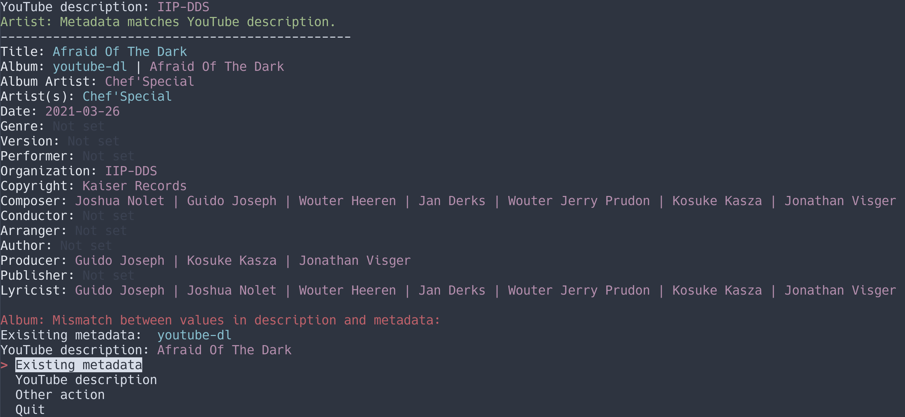
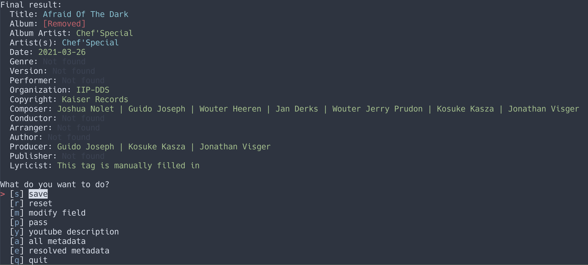

# Retag Opus

Say you have a music file in opus format, with a tag called
`description` that holds data about the music in the format used by
YouTube's ContentID. This script will help you parse that tag and put
the relevant data into the tags where it actually belongs, such as
`title`, `artist`, and `album`.

# Dependencies

Retag requires
[simple-term-menu](https://github.com/IngoMeyer441/simple-term-menu) to
be installed.

# Usage

Run the script like so:

```console
$ python3 retag --directory /path/to/directory/with/your/opus/files.opus
```

There is also a help (`-h`) flag:

```console
$ retag -h
usage: main.py [-h] [-d DIR] [-v] [-V]

options:
-h, --help            show this help message and exit
-s {bash,zsh,tcsh}, --print-completion {bash,zsh,tcsh}
                      print shell completion script
-a, --all             Even if there is no YouTube description, suggest improving existing tags
-d DIR, --directory DIR
                      directory in which the files to be retagged are located
-V, --version         show program's version number and exit
```

Retag will go through the opus file in the root of the directory you
provided and try to parse tag information from the YouTube description
if it is in the tags and from the original tags (e.g. adding another
artist if the title indicates a featured artist). It might look like
this:



Purple text indicates that the tag comes from the YouTube description.
Blue indicates that the tag existed in the metadata since before. Yellow
indicates that the tag comes from interpreting one of the original tags,
and green indicates that the tag has been interpreted from one of the
new tags taken from the YouTube description.

As you go on adjusting tags, they turn green for indicating that you're
done adjusting them. In the end, some tags may stay blue, indicating
that you have selected the original tag or that no new data is
available. Here is an example of what it can look like:



As you can see, you can remove tags, which will make them print
"[Removed]" in red text. In the actual song metadata, they will just be
removed.

## Configuration

You can configure tags that should be deleted. There are two ways you can
configure these. You can either say an exact tag name that should be deleted –
that is, the name of the tag itself, not its value. You can also specify a regex
that, if fully matching any value in a tag, will result in that tag being
deleted.

You specify this information in the Retag-Opus configuration file which is
`retag.toml` in your `XDG_CONFIG_HOME` directory, so usually
`~/.config/retag.toml`. Here is an example:

```toml
tags_to_delete = [
  "language",
]
strings_to_delete_tags_based_on = [
  "delete_exactly_this",
  ".*delete_any_partial_match.*",
]
```

This will delete the `language` tag, any tag containing the exact value
`delete_exactly_this` but not `delete_exactly_this_other_thing`, and also any
tag that matches the last regex, such as `test_delete_any_partial_match_test`.

# Project status

The project is still under development. The most common tags can be
parsed but there are many more which will just be ignored. Work needs to
be done in usability.

Latest workflow status:


Latest version:


Acitivy since last release:


